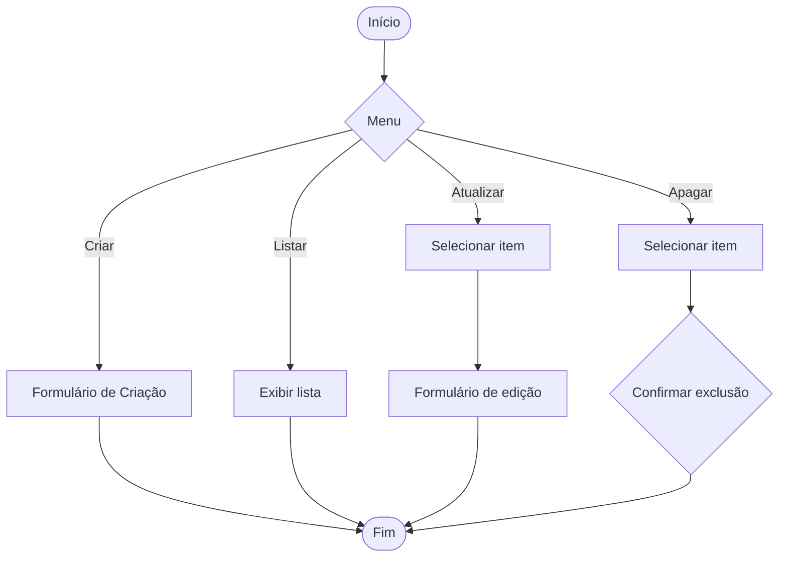

# Fluxograma (Mermaid)

Abaixo está um fluxograma em Mermaid que representa um fluxo CRUD genérico.

Copie e cole o bloco acima em qualquer visualizador que suporte Mermaid (por exemplo, no GitHub `.md` ou em editores como VSCode com extensão).
